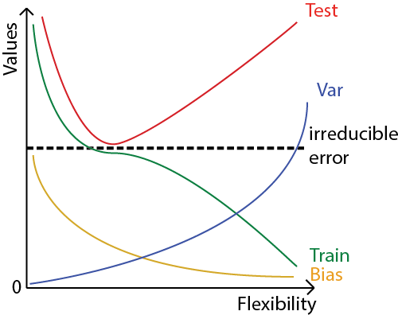

Chapter 2 Conceptual Exercise Solutions
---

2.1. Flexible vs inflexible methods performance

a. When sample size n is large, and the number of predictors p is small: fitting a flexible method often requires a great number of parameters, so this is difficult when the sample space is large.

b. when num of predictors p is large, and the number of observations is small, then it will be easy to fit an inflexible method

c. when the relationship between the predictors and response is very non-linear, then a flexible method will perform better

d. when the variance of the error terms is high, a more flexible method will perform better

2.2. Classification or regression?

a. Inference, regression, p = 4, n = 500

b. Classification, prediction, n = 20, p = 14

c. Prediction, regression, p = 4, n = 52

2.3.

a. 

2.4. c) Cluster analysis is useful when you want to classify a set of points into several groups, that have many different dimensions or characteristics

2.5. Flexible: Pros) Will always fit training data well, is preferred in non-linear cases Cons) prone to overfitting
    * Inflexible: Pros) the model may coincide with the true function that you are trying to approximate, preferred in linear cases Cons) makes assumptions about the underlying function, hard to correct these if the inflexible model was chosen wrongly

2.6. Parametric - pick a model, and optimize the parameters of that model, simpler. Non-parametric - is prone to overfitting the model, but fits the data very well.
